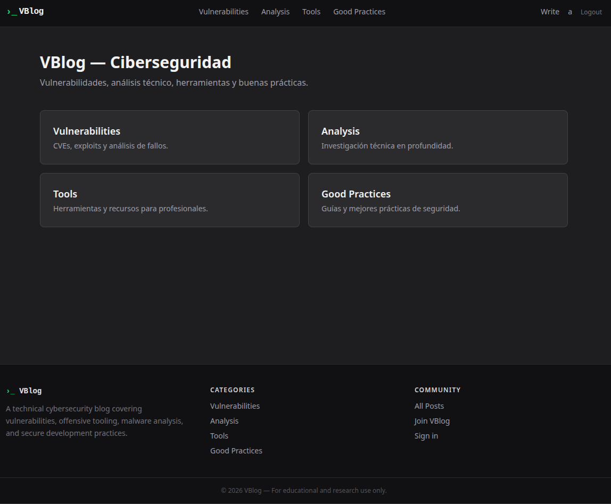

# VBlog — Aplicación Web Deliberadamente Vulnerable

[](https://github.com/Andonigt04/VBlog/actions/workflows/ci.yml)

VBlog es un blog construido con Laravel y Docker diseñado como ejercicio práctico de pentesting. Contiene vulnerabilidades reales e intencionadas que el alumno debe descubrir y explotar para escalar desde usuario anónimo hasta root en el servidor.



---

## Objetivo

Partir sin credenciales y alcanzar ejecución de comandos como `root`, encadenando las vulnerabilidades de la aplicación siguiendo una kill chain realista.

---

## Stack técnico

| Capa | Tecnología | Versión |
|---|---|---|
| Framework | Laravel | 13 |
| Runtime | PHP-FPM | 8.4 |
| Base de datos | PostgreSQL | latest |
| Frontend | Blade + Tailwind CSS (Vite) | — |
| Proxy | nginx | alpine |
| Contenedores | Docker Compose | — |

---

## Setup

**Requisitos:** Docker y Docker Compose.

```bash
git clone https://github.com/Andonigt04/VBlog.git
cd VBlog
sudo docker compose up --build -d
```

La aplicación queda disponible en `http://localhost`.

Para el subdominio interno:

```bash
echo "127.0.0.1  dev.vblog.local" | sudo tee -a /etc/hosts
```

---

## Vulnerabilidades

| # | Vulnerabilidad | OWASP 2021 | Endpoint |
|---|---|---|---|
| 1 | Exposición de credenciales | A05 – Security Misconfiguration | `GET /backup` |
| 2 | Fingerprinting del servidor | A05 – Security Misconfiguration | `GET /debug` + Server header |
| 3 | IDOR — enumeración de usuarios | A01 – Broken Access Control | `GET /api/users/{id}` |
| 4 | Mass Assignment — escalada de rol | A04 – Insecure Design | `PUT /api/update/user/{id}` |
| 5 | Broken Access Control — panel admin | A01 – Broken Access Control | `GET /dashboard` |
| 6 | Stored XSS | A03 – Injection | `POST /api/create/comment` |
| 7 | Cookie sin flag HttpOnly | A07 – Auth Failures | `Set-Cookie` |
| 8 | Cabeceras de seguridad ausentes | A05 – Security Misconfiguration | Headers HTTP |
| 9 | Path Traversal | A01 – Broken Access Control | `GET /api/admin/file` |
| 10 | SQL Injection | A03 – Injection | `GET /api/admin/stats` |
| 11 | Subida de fichero sin restricción → RCE | A03 – Injection | `POST /api/admin/upload` |
| 12 | Escalada de privilegios — sudo find | A05 – Security Misconfiguration | Sistema (GTFOBins) |

---

## Documentación

| Documento | Descripción |
|---|---|
| [docs/es/walkthrough.md](docs/es/walkthrough.md) | Walkthrough en español |
| [docs/en/walkthrough.md](docs/en/walkthrough.md) | Walkthrough en inglés |
| [docs/eu/walkthrough.md](docs/eu/walkthrough.md) | Walkthrough en euskera |
| [docs/es/arquitecture.md](docs/es/arquitecture.md) | Arquitectura Docker y superficie de ataque |

---

## Scripts de desarrollo

```bash
# Verificar que las cabeceras de seguridad están ausentes (vulnerabilidad confirmada)
bash dev/check-headers.sh http://localhost

# Ejecutar el pentest automatizado completo (confirma todas las vulns)
bash dev/pentest.sh http://localhost
```

---

## CI

El pipeline de GitHub Actions verifica en cada push:

| Job | Qué comprueba |
|---|---|
| Composer Audit | CVEs conocidos en dependencias PHP |
| PHPStan | Análisis estático del código |
| PHPUnit | Tests unitarios y de integración |
| Docker Integration | Build completo + cabeceras ausentes + pentest automatizado |

El job de pentest **falla si alguna vulnerabilidad deja de ser explotable** — garantiza que el ejercicio no se rompe accidentalmente.
